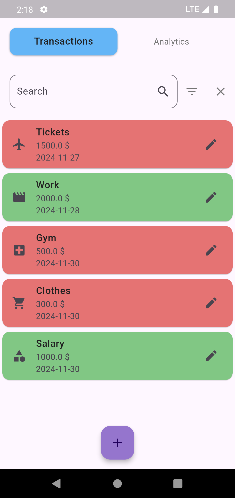
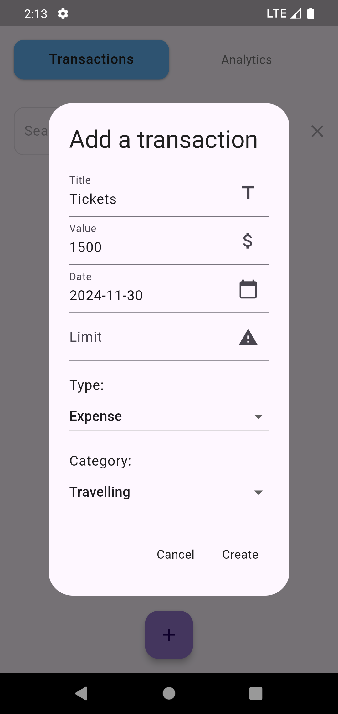
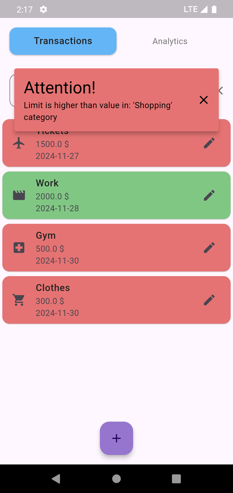
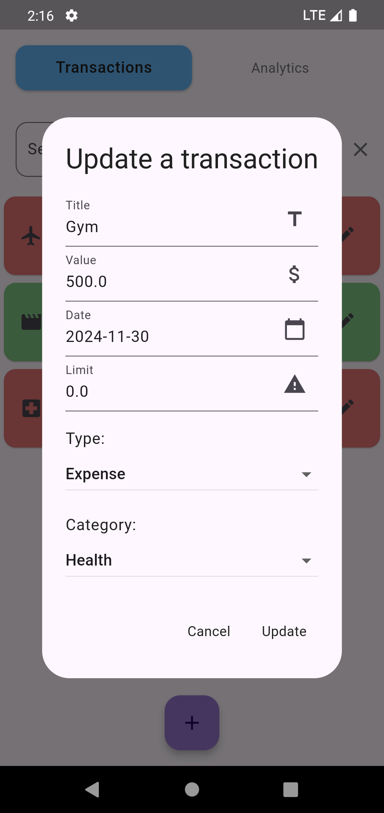
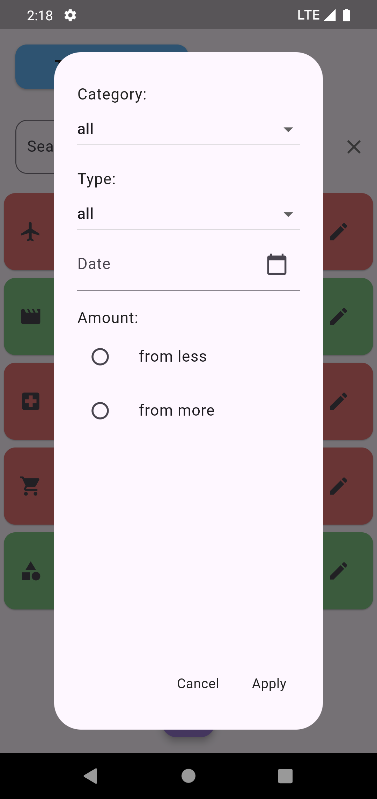
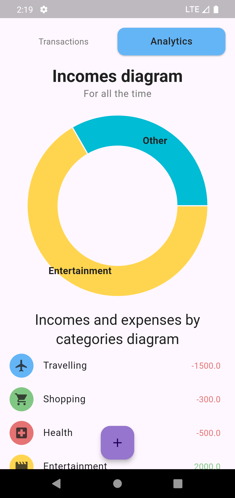

<h1 align="center">Personal Tracker</h1> 

<p align="center">

</img>
</img>
</img>
</p>

<p align="center">

</img>
</img>
</img>
</p>


# Personal Tracker
An application that allows you to keep records of income and expenses in various categories. App created using [Flutter](https://flutter.dev/) and [Dart](https://dart.dev/).


## Features

Creating and editing transactions
Transaction Search
Filtering by: 
  - type
  - categories
  - date
  - price
Statistics on expenses and income
Saving data


## How to Run

1. Clone the repo
   ```sh
   https://github.com/freerunningpanda/Personal-Tracker.git
   ```
2. Install all the packages by typing the following command
   ```sh
   flutter pub get
   ```
4. Run the code generator
   ```sh
   dart run build_runner build
   ```
3. Run the App


